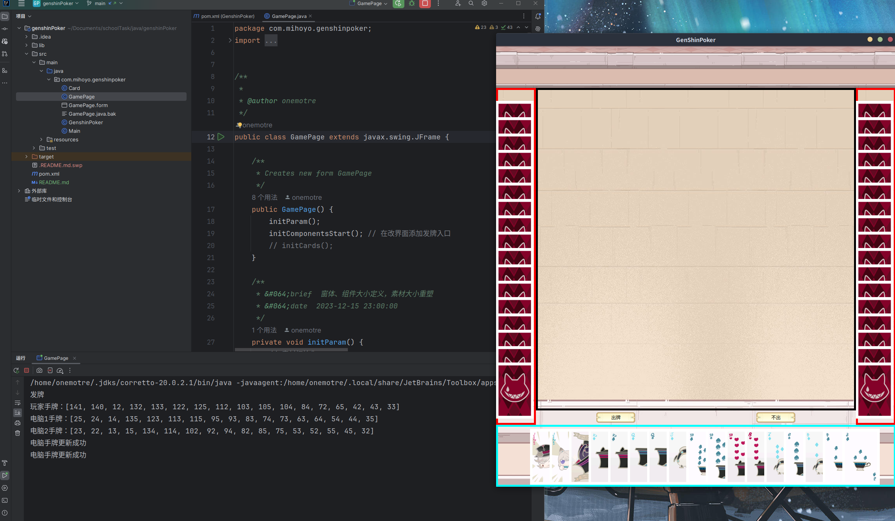
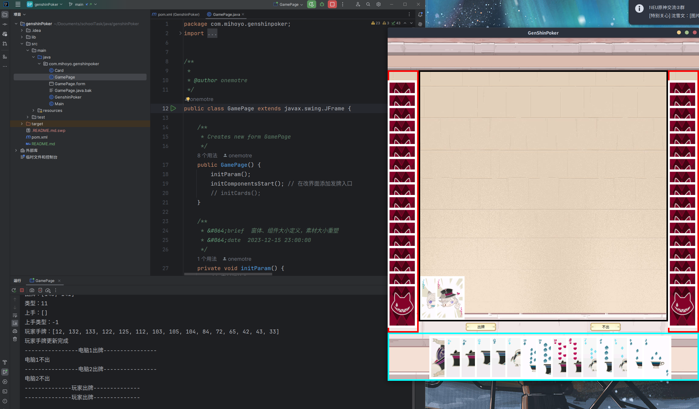

# GenshinPoker

原神扑克牌，学校java作业，制作扑克牌游戏（不完整）

## 运行示例





~[对手出牌](./pic/playerComOut.png)

## 运行说明

### 依赖项

- jdk (version>=20)
- maven (version>=20)
- NetBean AbsoluteLayout
> 由maven自动安装

### maven运行

#### Ubuntu

1. 安装依赖项

```bash
sudo apt install maven
```

2. 构建项目

- 删除之前的target文件
```bash
rm -rf ./taget
```

- 重新构建项目
```bash
mvn clean install
```

3. 运行项目

```bash
java -jar target/classes/com/mihoyo/genshinpoker/GamePage.jar   
```


